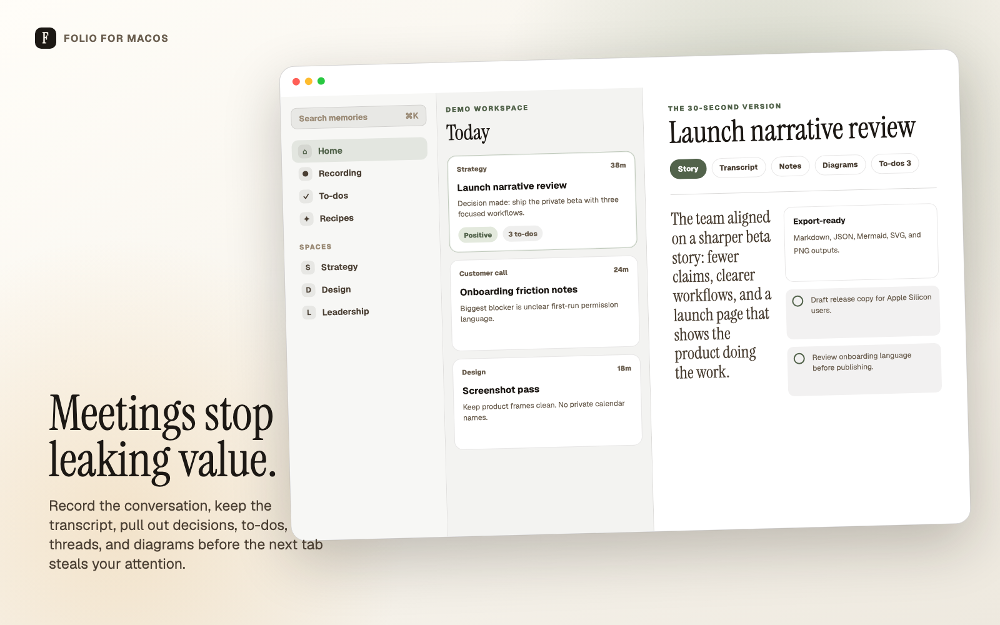
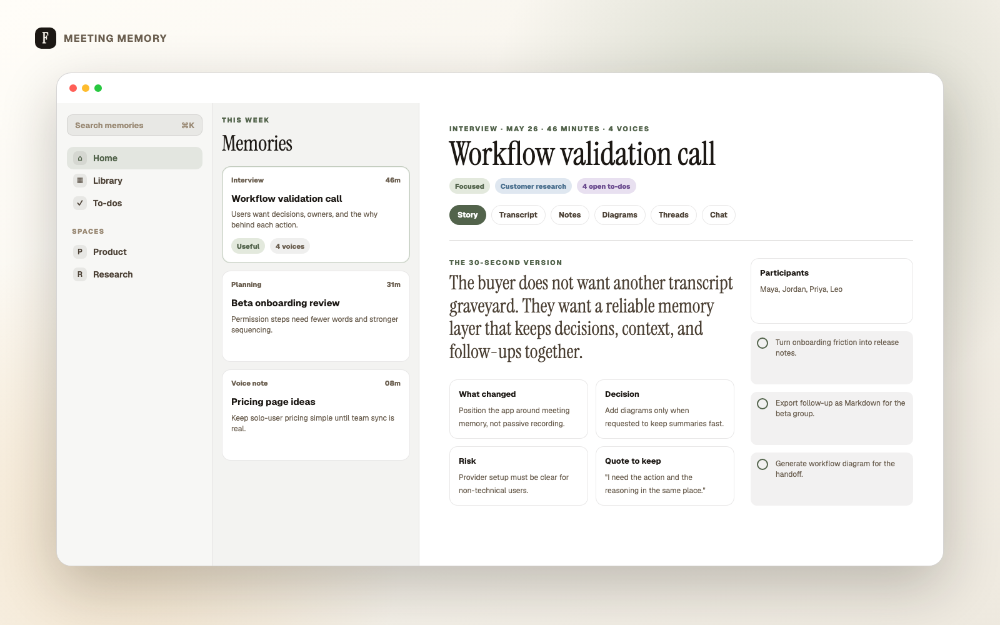
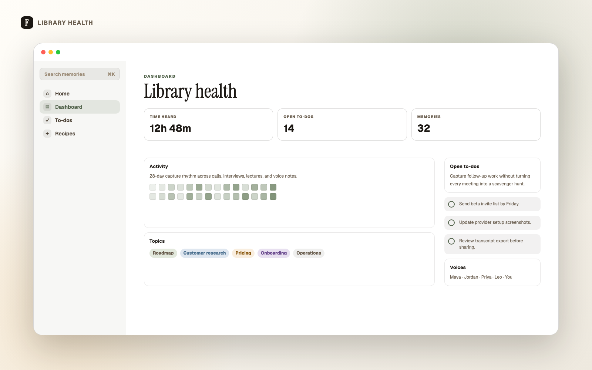
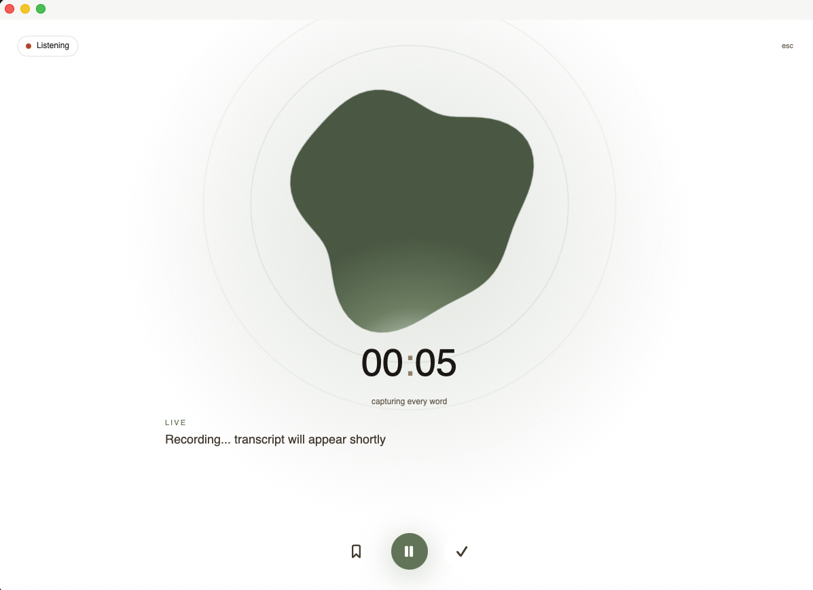

# Folio for macOS

Your meetings already happened. Make them useful.

Folio records meetings on your Mac, transcribes them, and turns the mess into searchable memory: decisions, to-dos, notes, diagrams, follow-up drafts, and answers you can ask for later.



## Download

**[Folio-arm64.dmg](https://github.com/andrewjones8210-source/Folio-releases/releases/latest/download/Folio-arm64.dmg)** — always the latest signed build. Apple Silicon (M1/M2/M3/M4), macOS 15.0 Sequoia or later.

## First launch

The first time you open Folio, macOS will say "Folio cannot be opened because it is from an unidentified developer." This is the standard one-time step for any independent Mac app.

1. Open **Applications** in Finder.
2. **Right-click** (or Control-click) **Folio.app** → choose **Open**.
3. If Sequoia hides the **Open** button on the first prompt, click **Cancel**, then right-click → **Open** again — the second prompt has the **Open** button.
4. Click **Open**.

Folio launches. From now on, double-click it from the Dock or Applications like any other app.

<details>
<summary>Advanced: Terminal one-liner alternative</summary>

```
xattr -dr com.apple.quarantine /Applications/Folio.app && open /Applications/Folio.app
```

</details>

## Why install it

Recordings rot. Slack eats decisions. Action items scatter.

Folio keeps the conversation, the context, and the work in one place:

- **Meeting memory** — story, transcript, notes, diagrams, to-dos, threads, recipes, and chat.
- **Dual audio capture** — microphone plus optional system audio for remote participants.
- **Local-first library** — meeting data is stored on your Mac.
- **Provider choice** — Claude Code, Anthropic, OpenAI-compatible providers, or Ollama.
- **Useful exports** — Markdown, JSON, Mermaid, SVG, and PNG.

## Product tour

### Story first, transcript when needed

Open with the decision trail, risks, highlights, and follow-ups. Drop into transcript detail only when proof matters.



### See the health of your meeting library

Track captured time, open to-dos, recurring topics, voices, and the latest unresolved work.



### Capture without leaving the room

Record microphone and system audio, then let Folio process the meeting into something you can use.



## Privacy posture

Folio stores your meeting library locally. Audio and transcripts stay on your Mac unless you export them or configure an external AI provider for summarization.

Screenshots on this page use demo data or capture-mode UI only. No private meeting content is shown.

## Auto-update

Once installed, Folio uses [Sparkle](https://sparkle-project.org) to auto-update from `appcast.xml` in this repository. New versions install in place.

## Issue tracking

[Folio-releases/issues](https://github.com/andrewjones8210-source/Folio-releases/issues).

## Source code

[andrewjones8210-source/Folio](https://github.com/andrewjones8210-source/Folio).
